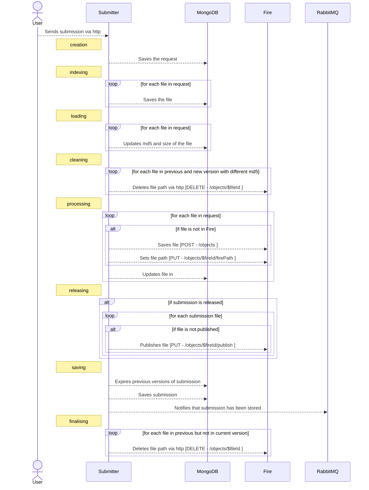

Sequence Diagram FIRE

```mermaid
sequenceDiagram
    actor person as User
    participant submitter as Submitter
    participant db as MongoDB
    participant store as Fire
    participant rabbit as RabbitMQ

    %% send http request
    person-->>submitter: Sends submission via http

    %% create request
    Note left of submitter:creation
    submitter-->>db: Saves the request 
    
    
    %% index request
    Note left of submitter:indexing
    loop for each file in request 
        submitter-->>db: Saves the file 
    end 

    %% load request
    Note left of submitter:loading
    loop for each file in request 
        submitter-->>db: Updates md5 and size of the file 
    end
    
    %% clean request
    Note left of submitter:cleaning
    loop for each file in previous and new version with different md5
    submitter-->>store: Deletes file path via http [DELETE - /objects/$fileId ]
    end
    
    %% process request
    Note left of submitter:processing
    loop for each file in request 
        alt if file is not in Fire
            submitter-->>store: Saves file [POST - /objects ]
            submitter-->>store: Sets file path [PUT - /objects/$fireId/firePath ]
        end
        submitter-->>db: Updates file in 
    end
    
    %% released 
    Note left of submitter:releasing    
    alt if submission is released
        loop for each submission file
            alt if file is not published
                submitter-->>store: Publishes file [PUT - /objects/$fireId/publish ]
            end
        end
    end
    
    %% saving
    Note left of submitter:saving    
    submitter-->>db: Expires previous versions of submission
    submitter-->>db: Saves submission
    
    %% notifications
    submitter-->>rabbit: Notifies that submission has been stored
        
    %% finalising
    Note left of submitter:finalising    
    loop for each file in previous but not in current version
        submitter-->>store: Deletes file path via http [DELETE - /objects/$fileId ]
    end
```
