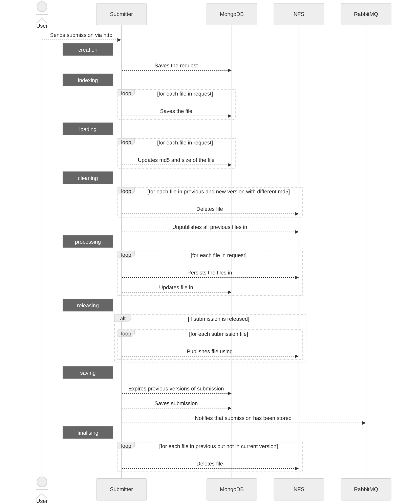

Sequence Diagram NFS
%%{init: { 'theme':'neutral', 'sequence': {'useMaxWidth':false} } }%%

```mermaid
sequenceDiagram
    %%{init: { 'theme':'neutral', 'sequence': {'useMaxWidth':false} } }%%
    actor person as User
    participant submitter as Submitter
    participant db as MongoDB
    participant store as NFS
    participant rabbit as RabbitMQ


    %% send http request
    person-->>submitter: Sends submission via http

    %% create request
    Note left of submitter:creation
    submitter-->>db: Saves the request 
    
    
    %% index request
    Note left of submitter:indexing
    loop for each file in request 
        submitter-->>db: Saves the file 
    end 


    %% load request
    Note left of submitter:loading
    loop for each file in request 
        submitter-->>db: Updates md5 and size of the file
    end    
    
    %% clean request
    Note left of submitter:cleaning
    loop for each file in previous and new version with different md5
        submitter-->>store: Deletes file
    end 
    submitter-->>store: Unpublishes all previous files in

    
    %% process request
    Note left of submitter:processing
    loop for each file in request 
        submitter-->>store: Persists the files in
        submitter-->>db: Updates file in 
    end
       
    %% released 
    Note left of submitter:releasing    
    alt if submission is released
        loop for each submission file
                submitter-->>store: Publishes file using
        end
    end
    
    
    %% saving
    Note left of submitter:saving    
    submitter-->>db: Expires previous versions of submission
    submitter-->>db: Saves submission

    %% notifications
    submitter-->>rabbit: Notifies that submission has been stored
    
    %% finalising
    Note left of submitter:finalising    
    loop for each file in previous but not in current version
        submitter-->>store: Deletes file
    end
```
