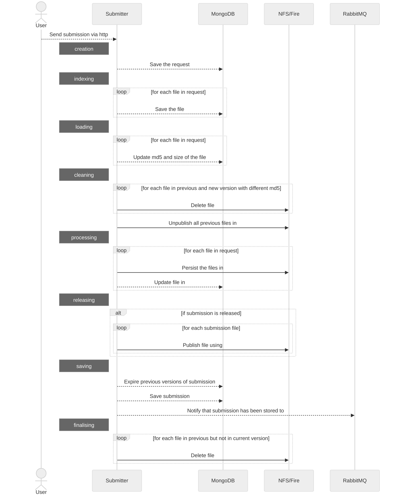

Submission Persistence Flow Diagram

```mermaid
sequenceDiagram
    %%{init: { 'theme':'neutral', 'sequence': {'useMaxWidth':false} } }%%
    actor person as User
    participant submitter as Submitter
    participant db as MongoDB
    participant store as NFS/Fire
    participant rabbit as RabbitMQ

    %% send http request
    person-->>submitter: Send submission via http

    %% create request
    Note left of submitter:creation
    submitter-->>db: Save the request 
    
    
    %% index request
    Note left of submitter:indexing
    loop for each file in request 
        submitter-->>db: Save the file 
    end 


    %% load request
    Note left of submitter:loading
    loop for each file in request 
        submitter-->>db: Update md5 and size of the file
    end    
    
    %% clean request
    Note left of submitter:cleaning
    loop for each file in previous and new version with different md5
        submitter->>store: Delete file
    end 
    submitter->>store: Unpublish all previous files in

    
    %% process request
    Note left of submitter:processing
    loop for each file in request 
        submitter->>store: Persist the files in
        submitter-->>db: Update file in 
    end
       
    %% released 
    Note left of submitter:releasing    
    alt if submission is released
        loop for each submission file
            submitter->>store: Publish file using
        end
    end
    
    
    %% saving
    Note left of submitter:saving    
    submitter-->>db: Expire previous versions of submission
    submitter-->>db: Save submission

    %% notifications
    submitter-->>rabbit: Notify that submission has been stored to
    
    %% finalising
    Note left of submitter:finalising    
    loop for each file in previous but not in current version
        submitter->>store: Delete file
    end
```
